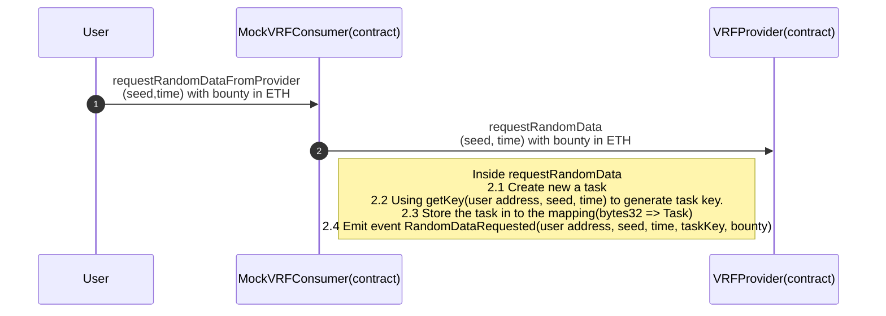
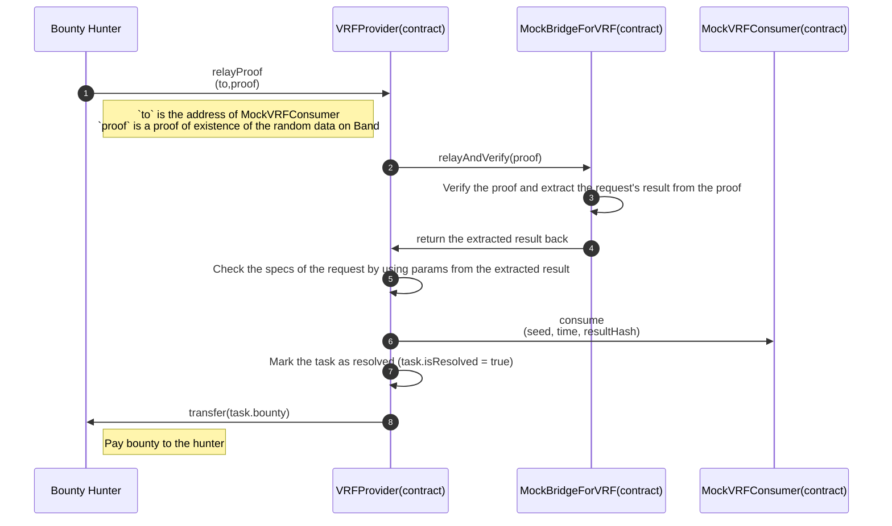

# VRF Contracts

This repository contains the implementation of Band's VRF with Solidity.

## Overview

VRF consists of multiple smart contracts and libraries working together. The figure below summarizes interaction between different smart contracts. Note that clear arrows represent inheritance relationship, while filled arrows represent `has-a-reference` relationship and filled dots represent `using` relationship. See comments at the top of the smart contracts' source codes for more details.

## Contracts

#### Libraries

- [Address](https://github.com/OpenZeppelin/openzeppelin-contracts/blob/master/contracts/utils/Address.sol) - A collection of functions related to the address type. In our case, only `isContract(address account)`(returns true if an account is a contract) function is used.

- [Obi](../obi/Obi.sol) - `Obi` is the standard way to serialized and deserialize binary data in the BandChain ecosystem. [👉 See doc](https://docs.bandchain.org/technical-specifications/obi.html)

- [VRFDecoder](./library/VRFDecoder.sol) - A wrapper of `Obi` in order to make it easier to use by `VRFProvider`.

- [Ownable](https://github.com/OpenZeppelin/openzeppelin-contracts/blob/master/contracts/access/Ownable.sol) - A contract module which provides a basic access control mechanism, where there is an account (an owner) that can be granted exclusive access to specific functions.

#### Interfaces

- [IBridge](../../interfaces/bridge/IBridge.sol) - An interface for interacting with `MockBridgeForVRF` contract which will be use by the `VRFProvider` contract.
- [IVRFProvider](../../interfaces/vrf/IVRFProvider.sol) - An interface for implementing `VRFProvider`.
- [IVRFConsumer](../../interfaces/vrf/IVRFConsumer.sol) - An interface for implementing

#### Bases

- [VRFProvider](./VRFProvider.sol) - An actual VRF provider contract that will be used by the actual random data consumer contract (this repo will use `MockVRFConsumer` to demonstrate contract interactions instead of the actual random data consumer contract).
- [VRFConsumerBase](./VRFConsumerBase.sol) - A basic contract for consumers who want to write extended contracts to suit their needs. `VRFConsumerBase` contain a reference of `VRFProvider` contract.

#### Mocks

**_Keep in mind that these mock contracts are for testing purposes and for easy visualization of the VRF system._**

- [MockBridgeForVRF](./MockBridgeForVRF.sol) - A mock contract of the actual Bridge ([👉 See actual Bridge](../bridge/Bridge.sol)).
- [MockVRFConsumer](./MockVRFConsumer.sol) - A mock contract that used as an example for an actual random data customer contract. The `MockVRFConsumer` is extended from `VRFConsumerBase`.

## Usage Flow

The figures below illustrates the interaction of each actor

**Steps**

1. The user requesting random data by calling `requestRandomDataFromProvider` function from the `MockVRFConsumer`.

2. The bounty hunter pick up an event emitted by the previous step. After that, the bounty hunter creates a request according to the event's params on Band's chain in order to retrieve the random data with proof from Band and then send it to the `VRFProvider` contract on Ethereum.

